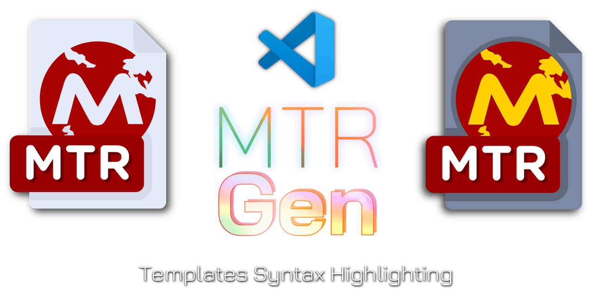

# MTRGen Templates Support - Syntax Highlighting, File Creation and more...

#### [Official Website](https://mtrgen.matronator.cz) | [Documentation](https://mtrgen.matronator.cz/public/docs/) | [Template Repository](https://mtrgen.matronator.cz/repository) | [JS/TS version](https://github.com/matronator/mtrgen-js) | [PHP version](https://github.com/matronator/MTRGen) | [VSCode Extension](https://marketplace.visualstudio.com/items?itemName=matronator.mtrgen-syntax)

This extension provides syntax highlighting to template files for [MTRGen](https://mtrgen.matronator.cz) ([matronator/mtrgen-js](https://github.com/matronator/mtrgen-js)) templates. It also provides a command to create files from MTRGen templates.

## Features

- Syntax highlighting for MTRGen templates
- Snippets for MTRGen templates
- File creation from MTRGen templates
- Command to create files from MTRGen templates

## Create files from MTRGen templates

This extension adds a button to the file explorer and a coresponding command to create files from MTRGen templates. Just run the command `MTRGen: Create File from MTRGen Template` and select a template from the list. If you have no MTRGen templates, the extension will create a `.mtrgen` folder in your project root and prompt you to create a new template.

## Snippets

The extension provides common snippets for MTRGen templates. The following snippets are available:

| Snippet                 | Description                                          | Example output                                                                                      |
|-------------------------|------------------------------------------------------|-----------------------------------------------------------------------------------------------------|
| `header`, `---`, `mtr`  | Creates MTRGen header block                          |  <pre>--- MTRGEN ---  name: foo  filename: bar  path: baz --- /MTRGEN ---</pre>                |
| `var`                   | Creates a variable placeholder                       |  <pre><% $foo %></pre>                  |
| `var=`                  | Creates a variable placeholder with a default value  |  <pre><% $foo='default' %></pre>                  |
| `var|`                  | Creates a variable placeholder with a filter         |  <pre><% $foo|upper %></pre>                  |
| `var=|`                 | Creates a variable placeholder with a default value and filter |  <pre><% $foo='default'|upper %></pre>                  |
| `if`                    | Creates an `if` statement block                      |  <pre><% if true %>   ...  <% endif %></pre>                                                            |
| `ifelseif`, `ifei`      | `if` statement block with `elseif` block             |  <pre><% if true %>   ...   <% elseif false %>   ...  <% endif %></pre>                           |
| `ifelse`, `ife`         | `if` statement block with an `else` block            |  <pre><% if true %>   ...  <% else %>   ...  <% endif %></pre>                                   |
| `ifelseifelse`, `ifeie` | `if` statement block with `elseif` and `else` blocks |  <pre><% if true %>   ...  <% elseif false %>   ...  <% else %>   ...  <% endif %></pre>  |
| `else`                  | `else` block                                         |  <pre><% else %>   ...  <% endif %></pre>                                                               |
| `elseif`, `elif`        | `elseif` block                                       |  <pre><% elseif false %>   ...  <% endif %></pre>                                                       |
| `comment`, `#`, `//`    | Comment block                                        |  <pre><# This is a comment #></pre>                                                                            |
| `for`                   | `for` loop block                                     |  <pre><% for item in items %>   ...  <% endfor %></pre>                                                 |
| `first`                 | `first` block                                        |  <pre><% first %>   ...  <% endfirst %></pre>                                                           |
| `last`                  | `last` block                                         |  <pre><% last %>   ...  <% endlast %></pre>                                                             |
| `sep`                   | `sep` block                                          |  <pre><% sep %>   ...  <% endsep %></pre>                                                               |
| `empty`                 | `empty` block                                        |  <pre><% empty %>   ...  <% endempty %></pre>                                                           |

## Supported languages

This extension adds language support for these languages natively or with support from third-party extensions:

- C
- C++
- C#
- Clarity
- CSS
- Dart
- Dockerfile
- Elixir
- Elm
- Erlang
- Gleam
- Go
- Haskell
- Haxe
- HTML
- Java
- JavaScript (including React)
- JSON
- Julia
- KDL
- Kotlin
- Less
- Lisp
- Lua
- Markdown
- Nim
- Objective-C
- OCaml
- Odin
- Perl
- PHP
- PowerShell
- Python
- Ruby
- Rust
- Scala
- SCSS
- Shellscript
- Solidity
- Swift
- Terraform
- TOML
- TypeScript (including React)
- XML
- YAML
- Zig

## License

This extension is released under the [MIT License](LICENSE).
